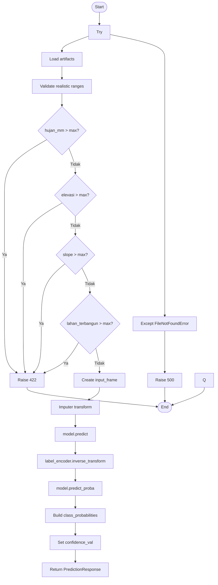

# 4.x Pengujian White Box

Pengujian White Box pada aplikasi prediksi daerah rawan banjir bertujuan untuk mengevaluasi logika internal program pada fitur prediksi banjir. Pengujian dilakukan menggunakan metode *Basis Path Testing* dengan menghitung nilai *Cyclomatic Complexity* berdasarkan *flowgraph* yang dibentuk dari alur logika fungsi `predict()`. Pada pembahasan ini, flowgraph mencakup fungsi `predict()` beserta validasi pendukung `validate_realistic_ranges()` karena keduanya membentuk satu rangkaian logika pada proses prediksi.

## 4.x.1 Pengujian Fitur Prediksi Banjir

Tabel 4.xx di bawah menunjukkan kode program yang digunakan sebagai objek *White Box Testing*.

**Tabel 4.xx Kode Program Prediksi Banjir**

| Baris Kode / Tahap | Node |
|---|---:|
| `try { ... }` | 1 |
| `load_artifacts()` | 2 |
| `validate_realistic_ranges(payload)` | 3 |
| `if (payload.hujan_mm > MAX_RAINFALL_MM)` | 4 |
| `if (payload.elevasi > MAX_ELEVATION_M)` | 5 |
| `if (payload.slope > MAX_SLOPE_PERCENT)` | 6 |
| `if (payload.lahan_terbangun > MAX_BUILT_AREA_RATIO)` | 7 |
| `input_frame = pd.DataFrame(...)` | 8 |
| `input_imputed = imputer.transform(input_frame)` | 9 |
| `prediction_index = int(model.predict(input_imputed)[0])` | 10 |
| `prediction_label = str(label_encoder.inverse_transform([prediction_index])[0])` | 11 |
| `probability_vector = model.predict_proba(input_imputed)[0]` | 12 |
| `class_probabilities = {...}` | 13 |
| `prediction_probability = round(...)` | 14 |
| `confidence_val = prediction_probability` | 15 |
| `return PredictionResponse(...)` | 17 |
| `except FileNotFoundError` / `raise HTTPException(status_code=500, ...)` | 18 |

Tabel 4.xx menampilkan tahapan kode program pada fitur prediksi banjir, sedangkan penjelasan setiap node dapat dilihat pada Tabel 4.xx.

**Tabel 4.xx Deskripsi Kode Program Prediksi Banjir**

| Node | Deskripsi |
|---|---|
| 1 | Blok utama penanganan proses prediksi. |
| 2 | Memuat model, imputer, dan label encoder. |
| 3 | Memanggil validasi batas realistis input. |
| 4 | Memeriksa batas maksimum curah hujan. |
| 5 | Memeriksa batas maksimum elevasi. |
| 6 | Memeriksa batas maksimum slope. |
| 7 | Memeriksa batas maksimum proporsi lahan terbangun. |
| 8 | Membentuk data frame input prediksi. |
| 9 | Melakukan imputasi data input. |
| 10 | Menghasilkan indeks kelas prediksi dari model. |
| 11 | Mengubah indeks kelas menjadi label prediksi. |
| 12 | Menghasilkan probabilitas setiap kelas. |
| 13 | Menyusun kamus probabilitas per kelas. |
| 14 | Mengambil probabilitas kelas hasil prediksi. |
| 15 | Menetapkan nilai confidence. |
| 17 | Mengembalikan respons prediksi. |
| 18 | Menangani error jika file model tidak ditemukan. |

Tabel 4.xx menampilkan deskripsi setiap node pada fungsi `predict()`, sedangkan *flowgraph* beserta perhitungan kompleksitas siklomatis dapat dilihat pada Tabel 4.xx.

**Tabel 4.xx Kompleksitas Prediksi Banjir**

**Kompleksitas**

`V(G) = E - N + 2`

`V(G) = 7`

Path 1 = `Start -> Try -> Load artifacts gagal -> Return 500 -> End`

Path 2 = `Start -> Try -> Load artifacts berhasil -> Validasi hujan_mm gagal -> Return 422 -> End`

Path 3 = `Start -> Try -> Load artifacts berhasil -> Validasi elevasi gagal -> Return 422 -> End`

Path 4 = `Start -> Try -> Load artifacts berhasil -> Validasi slope gagal -> Return 422 -> End`

Path 5 = `Start -> Try -> Load artifacts berhasil -> Validasi lahan_terbangun gagal -> Return 422 -> End`

Path 6 = `Start -> Try -> Load artifacts berhasil -> Seluruh validasi lolos -> Proses imputasi -> Prediksi model -> Probabilitas -> Confidence -> Return hasil prediksi -> End`

Path 7 = `Start -> Exception tak terduga -> Return 500 -> End`

Tabel 4.xx merupakan *flowgraph* yang menggambarkan alur proses prediksi banjir pada sistem. Berdasarkan perhitungan menggunakan rumus `V(G) = E - N + 2`, diperoleh nilai *Cyclomatic Complexity* sebesar `7`, sehingga terdapat `7` jalur independen (*independent path*) yang harus diuji.

Setiap jalur independen merepresentasikan kemungkinan alur eksekusi yang berbeda, mulai dari proses validasi input, pemuatan model, proses prediksi menggunakan algoritma XGBoost, perhitungan confidence, hingga pengembalian hasil prediksi maupun penanganan kesalahan (*exception handling*). Dengan menguji seluruh jalur independen tersebut, dapat dipastikan bahwa setiap percabangan logika pada fungsi `predict()` telah berjalan sesuai dengan rancangan sistem.
