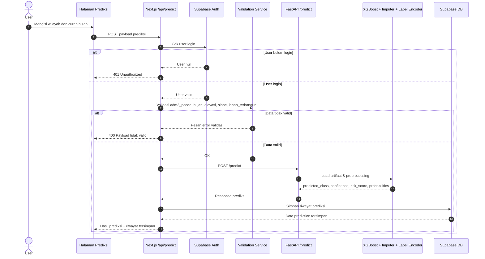

# Sequence dan Class Diagram

Dokumen ini berisi diagram UML konseptual berdasarkan implementasi aktual sistem pada proyek:
- Frontend Next.js
- API route Next.js di [`app/api`](../app/api)
- Service prediksi FastAPI di [`model/api.py`](../../model/api.py)
- Penyimpanan data pada Supabase

## Sequence Diagram

Diagram berikut menggambarkan alur utama saat pengguna melakukan prediksi banjir, mulai dari validasi input, pemanggilan model, penyimpanan hasil, sampai respons dikirim kembali ke antarmuka.

## Class Diagram

Diagram berikut bersifat konseptual. Proyek ini memakai banyak modul fungsional, jadi beberapa elemen direpresentasikan sebagai class/interface UML untuk memudahkan pembacaan struktur sistem.

```mermaid
classDiagram
    class PredictionRoute {
        +POST(request)
        -normalizePayload(payload)
        -normalizePredictedClass(value)
        -normalizeProbability(value)
    }

    class DashboardRoute {
        +GET()
    }

    class HistoryRoute {
        +GET(request)
        -parseFilters(searchParams)
    }

    class HistoryDetailRoute {
        +GET(request, context)
    }

    class WilayahRoute {
        +GET(request)
    }

    class AuthActions {
        +login(formData)
        +signup(formData)
        +signOut()
    }

    class DashboardDataService {
        +loadDashboardSummary(supabase, userId)
        +loadLatestPredictionSummary(supabase, userId)
        +loadHistorySummary(supabase, userId, filters)
        +loadPredictionDetail(supabase, userId, id)
        +savePredictionHistory(supabase, userId, input)
    }

    class PredictionValidation {
        +validatePredictionInput(payload)
        +validatePredictionInputField(field, value)
        +isFiniteNumber(value)
    }

    class FloodPredictionAPI {
        +health()
        +predict(payload)
    }

    class PredictionRequest {
        +adm3_pcode: string
        +hujan_mm: float
        +elevasi: float
        +slope: float
        +lahan_terbangun: float
    }

    class PredictionResponse {
        +predicted_class: string
        +confidence: float
        +risk_score: float
        +description: string
        +probabilities: map
    }

    class DashboardSummary {
        +totalKecamatan: number
        +totalFactorData: number
        +totalPredictions: number
        +distinctPredictionRegions: number
        +classCounts: Record
        +latestPredictions: PredictionWithLocation[]
        +mapPoints: PredictionWithLocation[]
        +latestPredictionByPcode: Record
    }

    class HistorySummary {
        +rows: PredictionWithLocation[]
        +total: number
        +totalPages: number
        +page: number
        +pageSize: number
        +filters: HistoryFilters
        +kabupatenList: string[]
        +kecamatanList: string[]
        +centroids: KecamatanCentroidRow[]
    }

    class HistoryFilters {
        +kabupaten: string
        +kecamatan: string
        +risk: string
        +dateFrom: string
        +dateTo: string
        +page: number
        +pageSize: number
    }

    class KecamatanCentroidRow {
        +adm3_pcode: string
        +kabupaten: string
        +kecamatan: string
        +latitude: number
        +longitude: number
        +elevasi: number
        +slope: number
        +lahan_terbangun: number
    }

    class PredictionRow {
        +id: number
        +user_id: string
        +adm3_pcode: string
        +rainfall: number
        +elevation: number
        +slope: number
        +built_area: number
        +predicted_class: FloodRiskClass
        +confidence: number
        +risk_score: number
        +created_at: string
    }

    class PredictionWithLocation {
        +kabupaten: string
        +kecamatan: string
        +latitude: number
        +longitude: number
    }

    class PredictionInsertInput {
        +adm3_pcode: string
        +hujan_mm: number
        +elevasi: number
        +slope: number
        +lahan_terbangun: number
        +predicted_class: FloodRiskClass
        +confidence: number
        +risk_score: number
        +probabilities: Record
    }

    class FloodRiskClass {
        <<enumeration>>
        Aman
        Rawan
        Sangat Rawan
    }

    class SupabaseClient {
        <<external>>
    }

    class FastAPIService {
        <<external>>
    }

    PredictionRoute --> PredictionValidation : validasi
    PredictionRoute --> DashboardDataService : simpan hasil
    PredictionRoute --> SupabaseClient : auth + insert
    PredictionRoute --> FastAPIService : panggil prediksi

    DashboardRoute --> DashboardDataService : ringkasan
    HistoryRoute --> DashboardDataService : daftar riwayat
    HistoryDetailRoute --> DashboardDataService : detail riwayat
    WilayahRoute --> SupabaseClient : baca master wilayah
    AuthActions --> SupabaseClient : login/signup/logout

    DashboardDataService --> PredictionRow
    DashboardDataService --> PredictionWithLocation
    DashboardDataService --> KecamatanCentroidRow
    DashboardDataService --> HistoryFilters
    DashboardDataService --> HistorySummary
    DashboardDataService --> DashboardSummary
    DashboardDataService --> PredictionInsertInput

    FloodPredictionAPI --> PredictionRequest
    FloodPredictionAPI --> PredictionResponse
    FloodPredictionAPI --> FloodRiskClass
```

## Catatan

- Sequence diagram di atas fokus pada alur utama prediksi karena itu inti proses bisnis sistem.
- Class diagram dibuat dari modul yang ada di implementasi, bukan dari rancangan OOP murni.
- Jika dibutuhkan, diagram dapat dipecah lagi menjadi versi khusus untuk `login`, `dashboard`, `riwayat`, atau `GIS map`.
